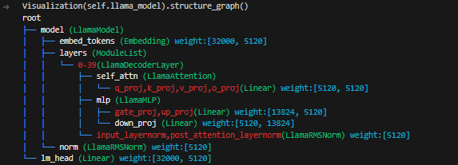

# 大模型代码学习

## 流程

| 步骤             | 描述                                                         |
|-----------------|--------------------------------------------------------------|
| 输入数据     | 输入是一段文本，可以是一个句子或段落，被表示为单词或字符的序列。   |
| Tokenization | 1. 文本被切分为Token序列。<br>2. Tokens映射为整数索引，代表其在语料库中的位置。 <br>3. 通常使用工具如sentencepiece实现。                        |
| Embedding   | 每个Token通过Embedding层被映射为一个固定大小的实数向量(Embedding Vector)。 |
| 位置编码     | 1. 为每个Token加上位置编码(Positional Encoding)来区分并了解其在句子中的位置。<br>2. 位置编码和Embedding向量在同一维度上直接相加。 |
| Transformer结构 | 1. 在生成任务中，主要使用Transformer的decoder部分(例如GPT, LLaMA)。<br>2. 使用Self-Attention机制来模拟Token之间的关系。  |
| 自回归生成     | 1. 采用自回归方式逐个生成Token。<br>2. 在每个解码步骤中，根据之前生成的Token来预测下一个Token。|
| 输出处理       | 1. 生成的Token序列经过输出层(通常是线性层 + Softmax)来计算每个Token的概率。<br>2. 可以采用贪心策略、多项式抽样或Top-p采样等方式来选择下一个Token。  |


## Code

### LLaMA2
> copy from [transformers](https://github.com/huggingface/transformers/blob/main/src/transformers/models/llama/), date: 2023-09-11



步骤：

1. 复制代码至 `src`
2. `src` 中将 `...` -> `transformers.`


## 准备

### 准备权重

#### LLaMA

```bash
cd ./ckpt
ln -s /root/share/LLama2/llama-2-13b-chat-hf ./llama-2-13b-chat-hf
```

## 阅读材料

- [ ] [Llama 2详解](https://zhuanlan.zhihu.com/p/649756898)
  LLaMA 整体流程、模型框架图
- [ ] [Llama源码深入解析](https://zhuanlan.zhihu.com/p/648365207)
  TODO
- [ ] 